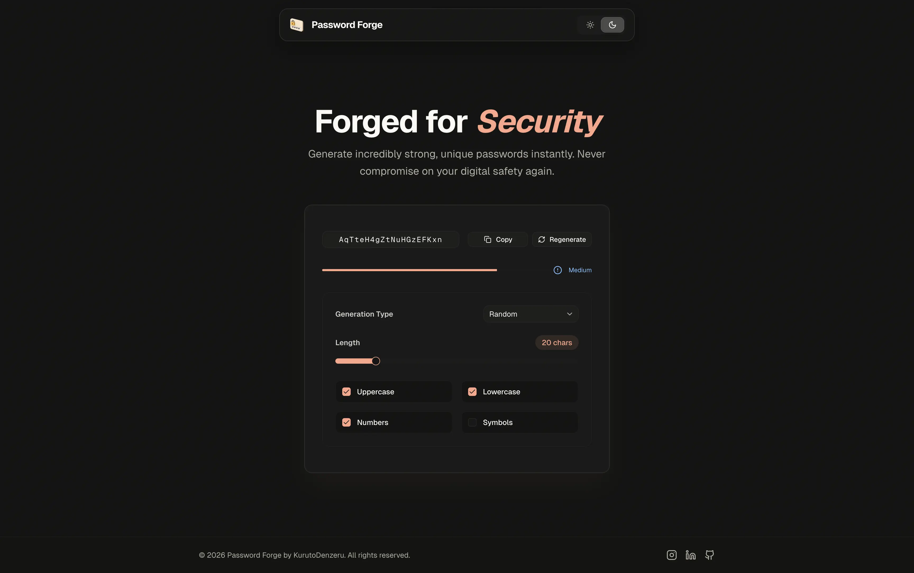

🔑 Sleek and secure password generator built with React.js and Tailwind. Customize length, characters, and complexity. Generated client-side for privacy.

## ☁️ Deploy your own

[](https://vercel.com/new/clone?repository-url=https://github.com/KurutoDenzeru/Password-Forge)
[](https://app.netlify.com/start/deploy?repository=https://github.com/KurutoDenzeru/Password-Forge)

## ✨ Features

- **Random & Memorable Passwords**: Generate both random and memorable passwords for any use case.
- **Customizable Options**: Choose password length, character sets (uppercase, lowercase, numbers, symbols), and type.
- **Password Strength Meter**: Visual feedback on password strength using entropy and variety.
- **Copy & Regenerate**: One-click copy to clipboard and instant password regeneration.
- **Responsive Design**: Mobile-first, works seamlessly on all devices.
- **Modern UI/UX**: Built with Tailwind CSS, Shadcn UI, and Lucide icons for a clean, accessible interface.
- **Validation & Security**: Input validation with Zod, secure clipboard handling, and guard clauses for edge cases.
- **Accessible**: Keyboard navigation, ARIA labels, and tooltips for usability.

## 🧱 Tech Stack

- **Framework**: [Next.js 15](https://nextjs.org/)
- **UI**: [React 19](https://react.dev/), [Tailwind CSS 4](https://tailwindcss.com/), [Shadcn UI](https://ui.shadcn.com/), [Radix UI](https://www.radix-ui.com/), [Lucide Icons](https://lucide.dev/)
- **State & Validation**: [Zustand](https://zustand-demo.pmnd.rs/), [Zod](https://zod.dev/)
- **Tooling**: TypeScript, ESLint, PostCSS

## 🚀 Getting Started

Clone the repo, install deps, and boot the dev server:

```bash
git clone https://github.com/KurutoDenzeru/Password-Forge.git
cd Password-Forge
bun install
bun run dev
```

Open [http://localhost:3000](http://localhost:3000) to view the app.

## 📦 Build for Production

```bash
bun run build
bun start
```

## 🗂️ Configuration

The app is built under `src/`, with reusable UI components in `src/components` and page structure in `src/app`. Key areas to customize are:

```text
src/
  app/
    layout.tsx              # Root app layout component
    page.tsx                # Homepage route component
    globals.css             # Global styles for the app
  components/
    home-hero.tsx           # Homepage hero section component
    site-header.tsx         # Header component logic and markup
    site-footer.tsx         # Footer component logic and markup
    theme-provider.tsx      # Theme provider and context logic
    theme-toggle.tsx        # Theme toggle component logic
    password-generator/
      PasswordActions.tsx   # Buttons and actions for password controls
      PasswordGenerator.tsx # Password generation UI and logic
      PasswordOptions.tsx   # Password options form controls
      PasswordStrength.tsx  # Strength meter display and logic
      types.ts              # Password type definitions
      utils.ts              # Password generation utility functions
    ui/
      ...                   # Shadcn UI / Radix UI primitives used throughout the apps
```

## 🤝🏻 Contributing

Contributions are always welcome, whether you’re fixing bugs, improving docs, or shipping new features that make the project better for everyone.

Check out [Contributing.md](Contributing) to learn how to get started and follow the recommended workflow.

<!-- Please adhere to this project's `Code of Conduct`. -->

## ⚖️ License

This project is released under the MIT License, giving you the freedom to use, modify, and distribute the code with minimal restrictions.

For the full legal text, see the [MIT](LICENSE) file.