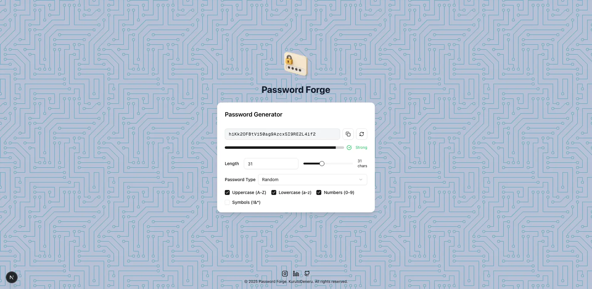

# Password Forge



🔑 Sleek and secure password generator built with React.js and Tailwind. Customize length, characters, and complexity. Generated client-side for privacy.

---

## ✨ Features

- **Random & Memorable Passwords**: Generate both random and memorable passwords for any use case.
- **Customizable Options**: Choose password length, character sets (uppercase, lowercase, numbers, symbols), and type.
- **Password Strength Meter**: Visual feedback on password strength using entropy and variety.
- **Copy & Regenerate**: One-click copy to clipboard and instant password regeneration.
- **Responsive Design**: Mobile-first, works seamlessly on all devices.
- **Modern UI/UX**: Built with Tailwind CSS, Shadcn UI, and Lucide icons for a clean, accessible interface.
- **Validation & Security**: Input validation with Zod, secure clipboard handling, and guard clauses for edge cases.
- **Accessible**: Keyboard navigation, ARIA labels, and tooltips for usability.

---

## 🛠️ Tech Stack

- **Framework**: [Next.js 15](https://nextjs.org/)
- **UI**: [React 19](https://react.dev/), [Tailwind CSS 4](https://tailwindcss.com/), [Shadcn UI](https://ui.shadcn.com/), [Radix UI](https://www.radix-ui.com/), [Lucide Icons](https://lucide.dev/)
- **State & Validation**: [Zustand](https://zustand-demo.pmnd.rs/), [Zod](https://zod.dev/)
- **Tooling**: TypeScript, ESLint, PostCSS

---

## 🚀 Getting Started

### 1. Clone the repository

```bash
git clone https://github.com/KurutoDenzeru/password-forge.git
cd password-forge
```

### 2. Install dependencies

```bash
# With npm
yarn install
# or
npm install
# or
bun install
```

### 3. Run the development server

```bash
npm run dev
# or
yarn dev
# or
bun run dev
```

Open [http://localhost:3000](http://localhost:3000) to view the app.

---

## 📦 Build for Production

```bash
npm run build
npm start
```

---

## Contributing

Contributions are always welcome!

See `Contributing.md` for ways to get started.

<!-- Please adhere to this project's `Code of Conduct`. -->

---

## 📄 License

[MIT](LICENSE)
